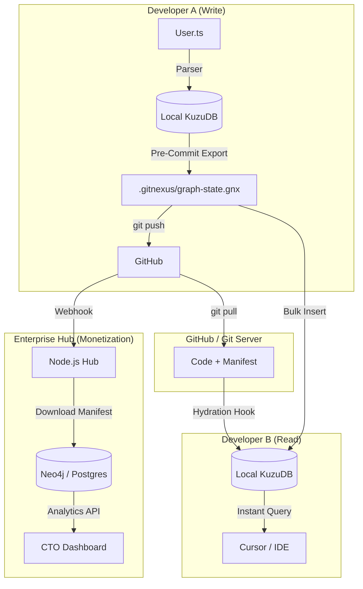

# Feature Specification: GitNexus "Guardian" (Live Impact Check)

## 1. Overview
The "Guardian" is an active, background monitoring system that provides real-time feedback to developers as they modify code. It leverages the deterministic Knowledge Graph (KuzuDB) to perform instant "Impact Analysis" and "Architecture Linting" without incurring LLM token costs.

**Goal:** Provide a "Safety Net" that catches breaking changes, side effects, and architectural violations *before* a commit is made.

## 2. Core Capabilities

### A. Live "Blast Radius" Detection
*   **Trigger:** 
    *   **Manual:** File Save / Debounced Keystroke.
    *   **AI-Aware Heuristic:** "Burst Write Cooldown" (See Section 3).
*   **Logic:**
    1.  Identify modified symbols (Functions, Classes) via incremental Tree-sitter parsing.
    2.  Execute Graph Query (Cypher) to find dependents.
        *   `MATCH (modified)<-[:CALLS*1..5]-(affected) RETURN affected`
    3.  Filter "affected" nodes that are outside the current file.
*   **User Experience:**
    *   **Toast/Status Bar:** "⚠️ Modification affects 12 external files."
    *   **Panel:** List of affected files/functions (e.g., "Breaks `PaymentService.process()`").
    *   **"Fix Prompt" Generator:** Button to copy a prompt for the AI agent (e.g., "Check `AuthService.ts` for regressions caused by my changes to `Login.tsx`").
*   **Cost:** **Zero Tokens.** (Pure Graph Traversal).

### B. Architecture "Linting"
*   **Trigger:** File Save / New Import Added.
*   **Logic:**
    1.  Detect new `IMPORTS` or `CALLS` edges in the graph.
    2.  Check against defined "Layer Rules" (e.g., defined in `.gitnexus/rules.yaml`).
        *   *Rule Example:* `Frontend` cannot import `Database`.
    3.  Execute Graph Query:
        *   `MATCH (source)-[:IMPORTS]->(target) WHERE source.layer = 'Frontend' AND target.layer = 'Database' RETURN source, target`
*   **User Experience:**
    *   **Inline Warning:** "❌ Architectural Violation: UI component cannot directly access Database types."
*   **Cost:** **Zero Tokens.** (Rule-based Graph Matching).

### C. "Smart" Explanation (On Demand)
*   **Trigger:** User clicks "Explain Risk" on a warning.
*   **Logic:**
    1.  Gather context: Source code of the change + Signatures of affected functions.
    2.  Send structured prompt to LLM (Small model: GPT-4o-mini / Local Llama).
    3.  *Prompt:* "The user modified `calculateTotal()`. This function is called by `InvoiceGenerator`. Explain potential risks."
*   **User Experience:**
    *   Natural language summary: "Changing the return type of `calculateTotal` will cause a compilation error in `InvoiceGenerator` which expects a number."
*   **Cost:** **Low.** (Only on user request, highly targeted context).

## 3. Technical Architecture

### The "Watcher" Loop
1.  **File Watcher:** Listens for `change` events in the workspace.
2.  **AI Detection Heuristic (Burst Mode):**
    *   *Logic:* Detect rapid file writes (3+ files in <2s) typical of AI Agents.
    *   *Action:* Suppress immediate checks (don't spam). Wait for "Cooldown" (e.g., 5s silence).
    *   *Trigger:* After cooldown, run "Full Impact Scan" and present summary.
3.  **Incremental Parser:** Updates the KuzuDB graph for the specific file (milliseconds).
    *   *Note:* Uses Tree-sitter's incremental parsing to be extremely fast.
3.  **Graph Engine:** Runs pre-compiled Cypher queries against the updated graph.
4.  **Client Interface (MCP/Extension):**
    *   Push notifications to VS Code / Cursor.
    *   Update "Impact" panel in the browser UI.

## 4. Agent Integration (Mandatory Workflow)

To ensure AI agents (Cursor, Claude, etc.) utilize GitNexus, we leverage "Prompt Engineering via Context" and Tool Definitions.

### A. The `.cursorrules` Protocol
*   **Mechanism:** A `.cursorrules` file in the project root enforces agent behavior.
*   **Content:**
    ```markdown
    # GitNexus Safety Protocol
    You have access to `@gitnexus` tools.
    
    **MANDATORY WORKFLOW:**
    1. **PLANNING:** Before writing code, use `gitnexus_get_dependencies` to map the blast radius.
    2. **VERIFICATION:** After EVERY code modification, you MUST run `gitnexus_detect_impact`.
    3. **REPORTING:** If risks are found, fix them or report to user.
    ```

### B. "Bossy" Tool Descriptions
*   **Mechanism:** Update MCP Tool definitions to be imperative.
*   **Description:** "CRITICAL SAFETY TOOL. MUST be used after modifying code. Scans graph for broken dependencies. Returns affected files."

### C. "Fix Prompt" Generator
*   **Mechanism:** If the Agent ignores the tools and the "Guardian" detects a break, the popup offers a "Copy Fix Prompt" button.
*   **Prompt:** "Your changes to X broke Y. Use `gitnexus_detect_impact` to verify and fix."

## 5. Distributed Knowledge Graph (Git-Native Architecture)

To enable "B2B / Team" features without a central server, we use Git itself as the synchronization mechanism for the Knowledge Graph. This is the **"Git-Native Knowledge Graph"** architecture.

### A. The Core Concept: "Graph Manifest"
You cannot commit the raw KuzuDB database files (binaries) to Git. Instead, we use a lightweight, diff-friendly **Graph Manifest**.

*   **File Path:** `.gitnexus/graph-state.jsonl.gz`
*   **Content:** A compressed JSON Lines dump of the Nodes and Edges (semantic data only).
*   **Purpose:** Acts as the "Transport Layer" for the graph between machines.

### B. The Workflow

#### Step 1: The "Write" Op (Local Dev)
1.  **Code Change:** Developer modifies `User.ts`.
2.  **Local Indexing:** GitNexus CLI updates local KuzuDB instantly (Incremental Update).
3.  **Pre-Commit Hook:**
    *   Trigger: `git commit`
    *   Action: GitNexus dumps the current KuzuDB state to `.gitnexus/graph-state.jsonl.gz`.
    *   Optimization: Only dumps semantic data (e.g., "Func A calls Func B"), not the full AST, keeping it small.

#### Step 2: The "Transport" (Git Sync)
*   `git push` uploads the Code + Graph Manifest.
*   **Crucial:** The graph version is now cryptographically tied to the commit hash. No "drift" between code and graph.

#### Step 3: The "Read" Op (Teammate Pull)
1.  **Git Pull:** Teammate receives new code + new manifest.
2.  **Post-Merge Hook / Hydration:**
    *   Trigger: Git detects change in `.gitnexus`.
    *   Action: GitNexus CLI reads the manifest and **bulk-inserts** it into the local KuzuDB.
    *   **Result:** Teammate has a fully queried graph in seconds (vs. minutes of re-parsing).

### C. Conflict Resolution: "Discard and Rebuild"
What happens if two devs change the graph simultaneously?

*   **Scenario:** Merge conflict in `.gitnexus/graph-state.jsonl.gz`.
*   **Strategy:**
    1.  GitNexus detects the conflict in the manifest file.
    2.  It **discards** the conflicted manifest.
    3.  It runs the **Parser** locally on the *merged* source code (Source of Truth).
    4.  It generates a **fresh, correct** manifest.
*   **Philosophy:** The Graph is a *derivative* of the Code. We never manually merge the graph; we regenerate it from the source.

### D. Architecture Diagram (Mermaid)



### E. B2B / Enterprise "Hub" Integration
The "Hub" is a lightweight server that monetizes this architecture.
1.  **Action:** Subscribes to the repo's webhooks.
2.  **Ingestion:** Downloads *only* the manifest file (not the source code).
3.  **Storage:** Loads it into a centralized DB (Neo4j/Postgres) for organization-wide queries.
4.  **Security:** "We don't see your code, only your graph structure."


## 7. Implementation Roadmap
1.  **Phase 1:** Implement `FileWatcher` in CLI + Incremental Graph Update.
2.  **Phase 2:** Create `ImpactQuery` engine (Cypher queries for dependents).
3.  **Phase 3:** Build MCP Tool `get_live_impact` for Editor integration and "Bossy" descriptions.
4.  **Phase 4:** Implement Git-Native Graph Sync (Manifest generation + Pre-commit hook).
5.  **Phase 5:** Add Architecture Rule definition schema (`.gitnexus/rules.yaml`).

